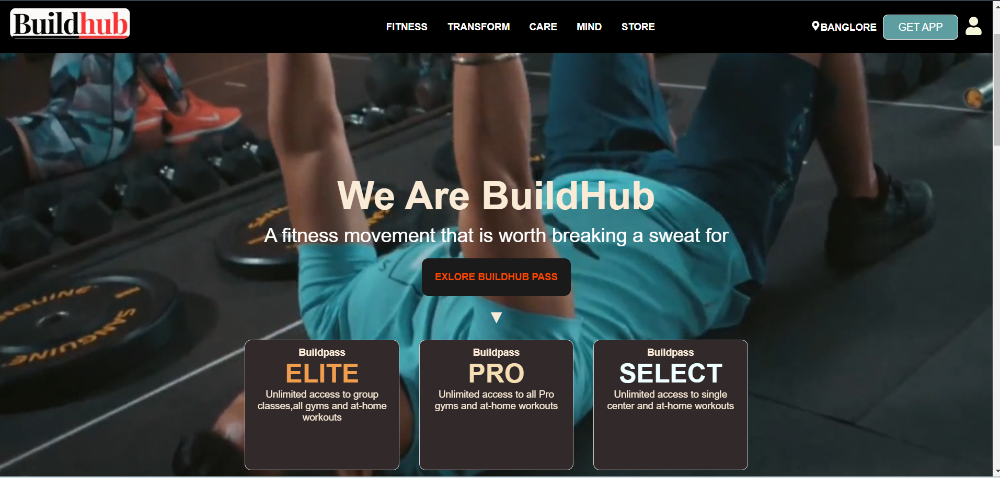
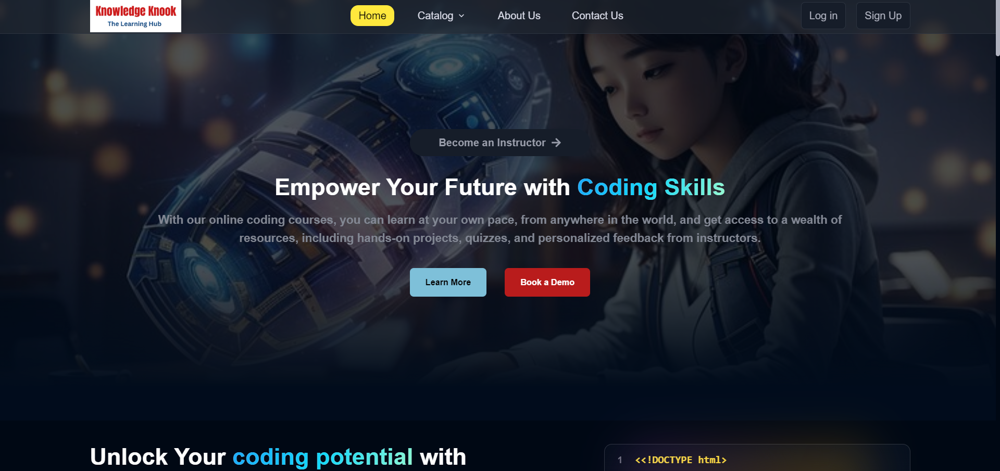
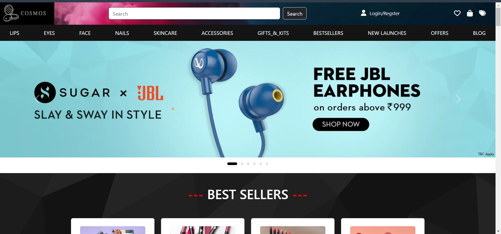

# My Portfolio

Welcome to my  portfolio! This site showcases my skills, projects, and experience as a Full Stack Developer specializing in React.js, Tailwind CSS, TypeScript, Node.js, and Express.js.

## Table of Contents
- [About Me](#about-me)
- [Features](#features)
- [Projects](#projects)
- [Technologies Used](#technologies-used)
- [Setup](#setup)
- [Contact](#contact)
- [License](#license)

## About Me

I'm Prati Raj, a Full Stack Developer with expertise in building modern web applications. I have a strong background in both frontend and backend development and enjoy creating solutions that enhance user experience and solve complex problems.

## Features

- **Interactive Projects**: Explore my work with detailed descriptions and live demos.
- **Responsive Design**: Optimized for both desktop and mobile viewing.
- **Dynamic UI**: Built with React.js and styled with Tailwind CSS for a seamless user experience.
- **API Integration**: Backend powered by Node.js and Express.js.

## Projects

### [Project 1: BuildHub](https://github.com/babureddyg2308/BuildHub_Rct104.git)
Description: BuildHub is a revolutionary online platform designed to inspire and guide you on your fitness journey. Much like Cult Fit, we believe that fitness is not just a destination, but a way of life/

  

### [Project 2:Knowledge Knook](https://github.com/kPratik07/LG-Legends_053-NEM104-.git)
Description: Knowledge Knook is a fully functional edu-tech platform that enables users to create, consume, and rate educational content.

### [Project 3: Cosmos](https://github.com/tashwini-p/Cosmos-and-Figma.git)
Description: Cosmos - All Things Cosmetics: In this project, we created a replica of Sugar Cosmetics using Bootstrap, incorporating slight design tweaks and a custom logo to highlight our skills and ensure originality.

## Technologies Used

- **Frontend**: [React.js](https://reactjs.org/), [Tailwind CSS](https://tailwindcss.com/), [TypeScript](https://www.typescriptlang.org/)
- **Backend**: [Node.js](https://nodejs.org/), [Express.js](https://expressjs.com/)
- **Other Tools**: [HTML](https://developer.mozilla.org/en-US/docs/Web/HTML), [Git](https://git-scm.com/), [GitHub](https://github.com/)

## Contact

Feel free to reach out to me via [kpratik071997@example.com](mailto:email@example.com) or connect with me on [LinkedIn](https://www.linkedin.com/in/pratik-raj-543527214/).

# Screen shots 

